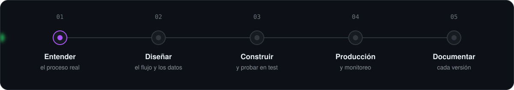

<div align="center">



<h1>


</h1>

<p>


</p>


</div>

##  &nbsp;01 — Quién soy

Desarrollador enfocado en **automatización de procesos** y **backend**. Conecto sistemas que no se hablan entre sí para que la operación corra sola, y documento cada flujo para que cualquiera lo pueda mantener.

```txt
▸ Flujos de automatización de punta a punta
▸ APIs y servicios backend en Node.js
▸ Integraciones entre plataformas de RH, operación y mensajería
▸ Documentación técnica de cada flujo y servicio
```

##  &nbsp;02 — Cómo trabajo



##  &nbsp;03 — Stack

<div align="center">


<br/><br/>


</div>

##  &nbsp;04 — Actividad

<div align="center">


<picture>
  <source media="(prefers-color-scheme: dark)" srcset="https://raw.githubusercontent.com/Mario-IY/Mario-IY/output/snake-dark.svg" />
  <source media="(prefers-color-scheme: light)" srcset="https://raw.githubusercontent.com/Mario-IY/Mario-IY/output/snake.svg" />
  
</picture>


<sub><code>MI—000</code> &nbsp;·&nbsp; del proceso manual al flujo automático</sub>

</div>
